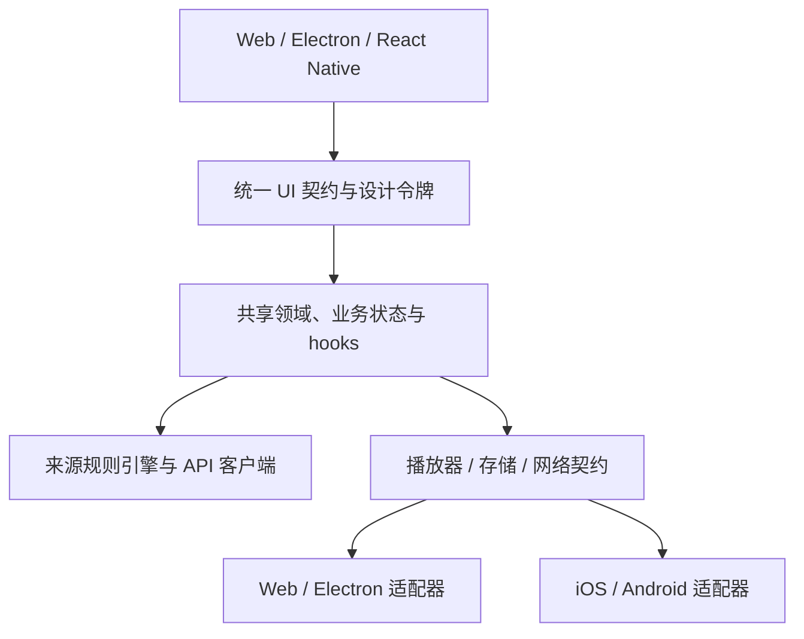

# Hana ACG

Hana ACG 是一个以前端为主导的动漫视频播放平台，首批目标客户端覆盖 **Web、macOS、Windows、iOS 和 Android**。

项目以 `AniBaka/` 作为产品与领域设计的主要参考，聚焦多来源番剧发现、匹配和播放体验；`ChattyPlay-Agent/` 仅作为 Web 工程的次要参考。更详细的来源系统与播放链路分析见 [AniBaka 架构与参考分析](docs/references/anibaka.md)。

## 第一版范围

第一版优先实现发现/首页、搜索、番剧详情、分集、多来源匹配、播放、手动换源和观看历史。社区、一起看、Torrent、WebDAV 及其他重型功能暂不进入第一版。

## 客户端与技术路线

- Web 使用 React + TypeScript。
- macOS 与 Windows 使用 Electron，并复用 Web 的 renderer 与 UI。
- iOS 与 Android 使用 React Native；可以由 Expo 管理项目，需要原生能力时采用支持原生模块的构建方式。
- 除上述核心技术路线外，具体库与工具尚未最终确定。

## 架构原则

目标是最大化业务与设计资产复用，而不是强迫五端共享同一套渲染实现。领域模型、来源规则引擎、API 客户端、业务状态与 hooks、播放器/存储/网络契约、图标与资源、设计令牌放入共享包；DOM 与原生行为不同的部分由 Web/Electron 和 React Native 各自实现。

组件对外保持一致的 API（例如 `@hanacg/ui`），必要时使用 `.web.tsx` 与 `.native.tsx` 平台入口。Web 与 Electron 共用 Web 实现，iOS 与 Android 共用 React Native 实现，五端共享契约与设计语言。



| 能力 | 复用范围 | 实现边界 |
| --- | --- | --- |
| 领域、来源、API、业务状态 | 五端共享 | 与渲染和平台 API 解耦 |
| UI 契约、设计令牌、图标资源 | 五端共享 | Web 与 Native 可有不同 renderer |
| Web UI | Web、macOS、Windows | Electron 复用 Web renderer |
| Native UI | iOS、Android | React Native 共享实现 |
| 播放、存储、网络、系统能力 | 共享接口 | 各平台通过明确 adapter 实现 |

Web 端仅在 CORS、请求头、Cookie 或 HTML 解析等浏览器限制确有需要时增加薄代理。Electron 的文件系统及其他特权能力必须留在 main/preload 边界之后，不直接暴露给 renderer。

## 建议工作区布局

仓库根目录本身就是 Hana ACG 主项目；以下目录应直接在当前根下逐步建立，不再嵌套另一个顶层主项目目录。

```text
.
├── apps/
│   ├── web/                 # React Web
│   ├── desktop/             # Electron main/preload，复用 Web renderer
│   └── mobile/              # React Native / Expo（iOS、Android）
├── packages/
│   ├── domain/
│   ├── source-engine/
│   ├── api-client/
│   ├── feature-core/
│   ├── player-contract/
│   ├── platform/
│   ├── design-tokens/
│   └── ui/                  # 或拆分为 ui-web/ 与 ui-native/
├── docs/
├── AniBaka/                 # 参考项目
└── ChattyPlay-Agent/        # 参考项目
```

## 参考资料

- `ChattyPlay-Agent/`：多功能 Web 应用参考，以源码快照纳入此仓库版本管理。上游：https://github.com/P1kaj1uu/ChattyPlay-Agent 。
- `AniCh-1.5.24/`：Flutter 动漫客户端参考，源码版本标记为 1.0.0，不纳入此仓库版本管理。
- `AniBaka/`：规则驱动的 Flutter 番剧聚合与播放器参考，以源码快照纳入此仓库版本管理。上游：https://github.com/AniBakaBaka/AniBaka 。
- [AniBaka 架构与参考分析](docs/references/anibaka.md)：来源系统、播放链路、外部服务边界及与现有参考项目的比较。
- `.agents/skills/frontend-design/`：项目级 Codex 前端设计技能。
