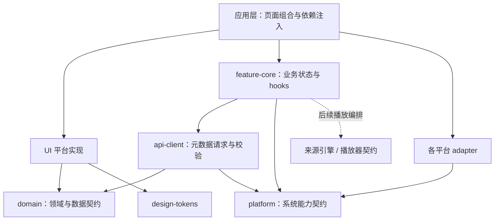

# Hana ACG

Hana ACG 是一个以前端为主导的动漫视频播放平台，首批目标客户端覆盖 **Web、macOS、Windows、iOS 和 Android**。

项目以 `AniBaka/` 作为产品与领域设计的主要参考，聚焦多来源番剧发现、匹配和播放体验；`ChattyPlay-Agent/` 仅作为 Web 工程的次要参考。更详细的来源系统与播放链路分析见 [AniBaka 架构与参考分析](docs/references/anibaka.md)。

## 第一版范围

第一版优先实现发现/首页、搜索、番剧详情、分集、多来源匹配、播放、手动换源和观看历史。社区、一起看、Torrent、WebDAV 及其他重型功能暂不进入第一版。

## 客户端与技术路线

- Web 使用 React + TypeScript。
- macOS 与 Windows 使用 Electron，并复用 Web 的 renderer 与 UI。
- iOS 与 Android 使用 React Native；可以由 Expo 管理项目，需要原生能力时采用支持原生模块的构建方式。
- 工作区使用 **pnpm monorepo**，Web 使用 **Vite + React + TypeScript**；本阶段使用 React hooks 管理发现页状态、Lucide 图标、Vitest 共享逻辑测试和 Playwright 浏览器验证。
- 路由、全局状态库、播放器实现、Native 构建与各端发布流程尚未确定；当前没有为了首页引入这些依赖。

## 本次交付：番剧发现

Web 已可运行：Codex 客户端风格的可折叠侧栏、亮色 / 暗色 / 跟随系统、推荐横幅、番剧类型筛选、评分 / 年份排序、搜索、每日放送、高分佳作、详情预览与本地追番。支持手机窄屏、键盘操作与请求失败反馈。

推荐页包含 11 部真实番剧的本地资料与海报快照；搜索、放送表和高分列表通过 Bangumi 公开 API 请求元数据。网络不可用时明确回退到精选；放送表失败不会生成虚假的更新记录。当前未接入视频播放、多来源规则执行、账户或观看记录写入。

桌面和移动端目录是带独立包名的工作区占位，还不能启动 Electron / React Native 客户端。播放器与来源包目前只定义接口。后续按以上平台边界逐步实现。

### 本地运行

需要 Node.js 22.12+（建议 24 LTS）、pnpm 10.30.3，以及 npm registry 网络访问。

```sh
pnpm install
pnpm dev
```

打开 http://127.0.0.1:5173 。构建后的静态资源位于 `apps/web/dist`。

```sh
pnpm check           # 类型检查、共享逻辑测试、生产构建
pnpm test:e2e        # 浏览器交互与视觉截图，需要安装 Google Chrome
pnpm build
pnpm --filter @hanacg/web preview
```

根命令只覆盖 Hana 工作区，不会运行或修改参考项目。E2E 使用受控的第三方接口响应，在线连通性另行验证。

默认数据地址是 `https://api.bgm.tv`。如所在网络无法访问，可参考 `apps/web/.env.example` 设置 `VITE_BANGUMI_API_BASE` 到兼容、允许浏览器跨域请求的 HTTPS 元数据端点。此项是公开地址，会进入客户端产物，不能填入密钥。当前不需要后端或薄代理。

界面规范、接口说明与素材出处见 [发现页设计](docs/design/discovery.md)。

## 架构原则

目标是最大化业务与设计资产复用，而不是强迫五端共享同一套渲染实现。领域模型、来源规则引擎、API 客户端、业务状态与 hooks、播放器/存储/网络契约、图标与资源、设计令牌放入共享包；DOM 与原生行为不同的部分由 Web/Electron 和 React Native 各自实现。

组件对外保持一致的 API（例如 `@hanacg/ui`），必要时使用 `.web.tsx` 与 `.native.tsx` 平台入口。Web 与 Electron 共用 Web 实现，iOS 与 Android 共用 React Native 实现，五端共享契约与设计语言。



图中实线表示依赖方向，平台 adapter 由应用层创建并注入共享业务；共享契约不反向依赖具体平台实现。各包职责、公开入口约束及开发规范见 [AGENTS.md](AGENTS.md)。

| 能力 | 复用范围 | 实现边界 |
| --- | --- | --- |
| 领域、来源、API、业务状态 | 五端共享 | 与渲染和平台 API 解耦 |
| UI 契约、设计令牌、图标资源 | 五端共享 | Web 与 Native 可有不同 renderer |
| Web UI | Web、macOS、Windows | Electron 复用 Web renderer |
| Native UI | iOS、Android | React Native 共享实现 |
| 播放、存储、网络、系统能力 | 共享接口 | 各平台通过明确 adapter 实现 |

Web 端仅在 CORS、请求头、Cookie 或 HTML 解析等浏览器限制确有需要时增加薄代理。Electron 的文件系统及其他特权能力必须留在 main/preload 边界之后，不直接暴露给 renderer。

## 工作区布局

仓库根目录本身就是 Hana ACG 主项目，所有包直接建立在当前根目录下。

```text
.
├── apps/
│   ├── web/                 # React Web
│   ├── desktop/             # Electron 入口占位，后续复用 Web renderer
│   └── mobile/              # React Native 入口占位（iOS、Android）
├── packages/
│   ├── domain/              # 番剧模型、查询契约与纯筛选逻辑
│   ├── source-engine/       # 来源适配器契约，规则执行待实现
│   ├── api-client/          # Bangumi 数据适配、校验、精选资料
│   ├── feature-core/        # 发现与追番 hooks
│   ├── player-contract/     # 跨端播放器契约
│   ├── platform/            # 网络、存储、媒体资源契约
│   ├── design-tokens/       # 跨端主题 token 与 Web CSS 变量
│   └── ui/                  # Web 组件与 Native 类型入口
├── tests/                   # 浏览器交互验证
├── docs/
├── AniBaka/                 # 参考项目
└── ChattyPlay-Agent/        # 参考项目
```

## 参考资料

- `ChattyPlay-Agent/`：多功能 Web 应用参考，以源码快照纳入此仓库版本管理。上游：https://github.com/P1kaj1uu/ChattyPlay-Agent 。
- `AniCh-1.5.24/`：Flutter 动漫客户端参考，源码版本标记为 1.0.0，不纳入此仓库版本管理。
- `AniBaka/`：规则驱动的 Flutter 番剧聚合与播放器参考，以源码快照纳入此仓库版本管理。上游：https://github.com/AniBakaBaka/AniBaka 。
- [AniBaka 架构与参考分析](docs/references/anibaka.md)：来源系统、播放链路、外部服务边界及与现有参考项目的比较。
- `.agents/skills/frontend-design/`：项目级 Codex 前端设计技能。
