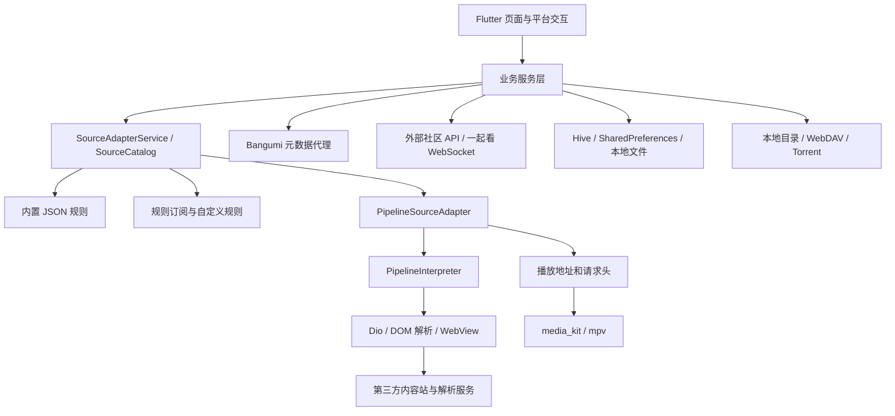

# AniBaka 架构与参考分析

分析日期：2026-09-13。

- 仓库：https://github.com/AniBakaBaka/AniBaka
- 本地目录：`AniBaka/`
- 分析提交：`c807a2c`（2026-08-26，fix watch party synchronization service and API integration）
- 应用版本：`5.1.0+0823`
- `.fvmrc` 固定 Flutter 3.44.9；`pubspec.yaml` 要求 Dart >=3.12.0 <4.0.0、Flutter >=3.44.0。
- 范围：静态阅读源码、配置和测试；未运行应用，未验证第三方视频站可用性。

## 核心结论

AniBaka 是 Flutter 客户端，包含可执行的视频源解析规则与规则引擎。它可以在客户端完成“搜索第三方站点 → 获取详情与剧集 → 解析播放地址 → 播放”的链路。这比当前 AniCh 参考代码仅请求作者 `/vod/{id}/{episode}` API 多出完整的来源适配层。

但它不包含第三方内容站的服务端，也未提供配套社区后端。登录、评论、历史同步、一起看等功能仍请求外部服务。客户端里的 HLS 代理、Torrent 流服务器和二维码登录服务属于本地辅助组件，不能当作完整社区后端部署。

## 架构

主要目录：

- `lib/main.dart`：启动、平台识别、存储与服务初始化。
- `lib/pages/`、`lib/widgets/`：页面、播放器、源选择、平台导航等 UI。
- `lib/services/`：播放器、搜索、历史、下载、弹幕、收藏、一起看等业务服务。
- `lib/source/`：源注册、规则模型、解释器、网络宿主、调度、WebView 和媒体地址提取。
- `lib/api/`：社区 API、Bangumi 元数据接口与缓存。
- `lib/storage/`：统一存储提供者、本地目录与 WebDAV。
- `assets/rules/`：13 份内置规则。
- `assets/anime4k/`：实际打包的画质增强 GLSL 文件。
- `test/`：52 个 `*_test.dart` 文件，另有测试辅助文件。

状态管理以 GetX 为主，部分服务使用 ChangeNotifier；网络层使用 Dio/http，播放器基于 media_kit，业务持久化使用 Hive，偏好和规则订阅配置使用 SharedPreferences。

## 视频来源系统

### 规则与执行器

规则格式为 `anx-rule/2`。每份规则声明 ID、名称、baseUrl、请求头和三个步骤数组：

| 阶段 | 输入 | 输出 |
| --- | --- | --- |
| search | 搜索词 | 统一 Series 列表 |
| detail | 条目地址或 ID | 播放线路和分集目录 |
| play | 分集地址或 ID | 媒体 URL，部分规则还带动态请求头/Cookie |

引擎支持 HTTP 请求、CSS/XPath 选择、JSON 路径、正则提取、模板变量、跟随链接和失败分支回退等操作；对部分动态页面可使用 WebView 获取渲染结果与媒体地址。

关键文件：

- `lib/source/model/source_rule.dart`：规则与步骤模型。
- `lib/source/engine/pipeline_interpreter.dart`：按步骤执行 search/detail/play。
- `lib/source/engine/pipeline_host.dart`：执行器需要的网络与解析能力接口。
- `lib/source/pipeline_source_adapter.dart`：规则到来源适配器的连接，处理请求头、Cookie、缓存和部分播放保活。
- `lib/source/adapter_base.dart`：来源接口、解析重试、结果缓存与媒体可达性检查。
- `lib/source/webview_adapter.dart`：动态页面解析，串行安排后台 WebView 任务。

例如 DM84 规则描述搜索列表、剧集列表及嵌入播放器的解析步骤；Xifanacg Next 规则通过站点 API 获取搜索与播放结果。规则存在不代表对应站点当前可用。

### 内置规则

实际打包的 13 个规则为：AkiAnime、Anime7、DM84、番薯动漫、GirigiriLove、路漫漫动漫、囧次元、Mgnacg 橘子动漫、MiFun、Xifanacg Next、TvTFun、Moonci、嘶哩嘶哩。

完整映射位于 `lib/source/store/bundled_rule_store.dart`。规则中心默认订阅 AniBakaRule 的 `index.json`，支持安装/更新规则、自定义订阅，以及网络失败后的缓存回退。

关联规则仓库：https://github.com/AniBakaBaka/AniBakaRule 。本次未另行下载或审查该仓库。

### 匹配与可靠性

- 使用统一来源接口，减少页面对具体站点的依赖。
- 标题匹配综合别名、季度、集数和类型，避免把不同季或剧场版直接混为同一资源。
- 候选匹配与媒体探测分开；解析出一个看似视频的 URL 后，通常还会探测可达性。特定签名地址或自行验证的规则存在例外。
- 请求调度默认全局并发 6、单域名并发 2，支持优先级和排队取消。
- 适配器实例采用 LRU 缓存，搜索与播放复用 Cookie 等上下文；规则更新后可失效重建。

匹配并非保证正确、可达性探测也不等同完整播放验证，但这些机制比仅保存一个视频地址更完善。

## 功能与实现程度

| 模块 | 代码中的实现 |
| --- | --- |
| 番剧发现 | 搜索、元数据、更新日程、详情、来源匹配与切换 |
| 播放器 | 分集、换源、倍速、字幕、播放进度、媒体会话、平台控制 |
| 弹幕 | 弹幕服务、发送、屏蔽、渲染与本地文件支持 |
| 离线下载 | MP4/普通文件及 HLS 分片缓存，任务持久化、暂停/恢复/删除 |
| Torrent | Magnet/Torrent、Tracker、Peer、Piece 管理，通过本地流服务连接播放器 |
| 媒体库 | 本地文件夹、WebDAV 提供者及浏览页面 |
| 投屏 | DLNA 页面和相关依赖/实现 |
| 画质增强 | Anime4K shader 资源、分档管线和 mpv glsl-shaders 属性应用 |
| 一起看 | 创建/加入房间、服务端返回 WebSocket 地址、播放状态同步与重连 |
| 平台体验 | 桌面窗口导航、移动端、Android TV 识别与交互分支 |

Anime4K 并非仅有 README 声明，代码实际加载 shader。能力仍受平台和渲染器约束：例如 Android `mediacodec_embed` 直接输出模式明确关闭该增强管线。未在实际设备验证各平台效果。

Torrent 和 HLS 也有实际实现，不能因此推断所有种子、媒体编码、加密方式和站点都受支持。

## 外部服务与部署边界

| 能力 | 本仓库包含什么 | 仍依赖什么 |
| --- | --- | --- |
| 规则解析视频源 | 规则、解释器、适配器、播放器 | 规则指向的内容站、媒体 CDN，部分规则调用额外解析接口 |
| 规则更新 | 订阅与安装客户端 | AniBakaRule 或用户配置的规则订阅 |
| 番剧元数据 | Bangumi API 客户端和匹配逻辑 | 当前配置的 `bgm.anibaka.com`、`p1.anibaka.com` 等代理 |
| 社区功能 | API 调用与客户端页面 | 默认 `www.anibaka.com`，可配置服务器地址 |
| 一起看 | 房间客户端与同步逻辑 | 房间 API 和 WebSocket 服务 |
| 本地播放/缓存 | 文件、播放器和任务逻辑 | 本地文件及可访问媒体源 |

项目提供 Flutter 多平台构建配置和 GitHub Actions/Fastforge 打包流程；本次未发现完整社区后端的源码、数据库迁移或部署清单。

因此它能够回答“客户端如何获取第三方番剧来源”，但不能单靠这个仓库部署作者的全部在线服务。

## 与已有参考项目比较

| 维度 | ChattyPlay-Agent | 当前 AniCh 参考代码 | AniBaka |
| --- | --- | --- | --- |
| 技术形态 | React + Hono，附独立服务 | Flutter 客户端 | Flutter 客户端与来源引擎 |
| 产品重点 | 工具、AI、娱乐与闲鱼自动化 | 番剧、图片内容、弹幕与追番 | 多源播放、规则扩展与媒体管理 |
| 来源逻辑 | 多种外部 API/解析代理 | 作者 API 返回播放线路 | 客户端执行可维护的来源规则 |
| 离线下载 | 视频下载代理 | 当前下载页占位 | 文件/HLS 下载任务实现 |
| 超分能力 | 未作为核心能力实现 | 当前源码未找到 | 有 Anime4K 资源及加载管线 |
| 测试 | 前次检查未发现业务测试 | 默认计数器示例 | 多个规则、播放器、下载周边和业务测试 |
| 上游服务完整性 | 部分后端随仓库提供 | 配套后端未提供 | 来源引擎提供，社区等在线后端未提供 |

## 对 hanacg 的参考判断

最有价值的是规则格式、来源接口、条目与播放源匹配、可达性检查、下载任务状态和播放会话分层。

如果 hanacg 保持 Web 技术路线，可以复用这些概念与规则数据设计；Flutter/Dart 执行器不能直接作为 React 代码使用。服务端或本地服务可以承接请求头、Cookie、站点解析等能力，页面负责目录、搜索和播放器交互。需要结合最终产品形态决定执行位置，不宜直接把原生客户端的网络行为搬进浏览器。

源码也存在维护成本：本次版本的管线解释器约 1858 行、来源宿主适配器约 926 行，站点变化仍需要持续更新规则。参考时应保留操作符/宿主分离和测试边界，避免形成新的巨型模块。

仓库许可证标记为 GPL-3.0-only；具体第三方材料标记见 `THIRD_PARTY_NOTICES.md`。

## 本次验证记录

- Git clone 成功，核对 origin 与提交号，参考仓库未作修改。
- 13 份内置 JSON 均可解析，format 均为 anx-rule/2，search/detail/play 均为非空数组。此检查不等同 Dart RuleValidator 或在线可用性验证。
- 检查了 52 个业务测试文件的分布及部分用例，没有声称测试已通过。
- 当前 shell 未找到 flutter、dart 或 fvm，因此未执行 Flutter 构建和测试；本任务未安装开发工具链。
- 未请求第三方视频站验证播放，也未登录或调用社区账户操作。
